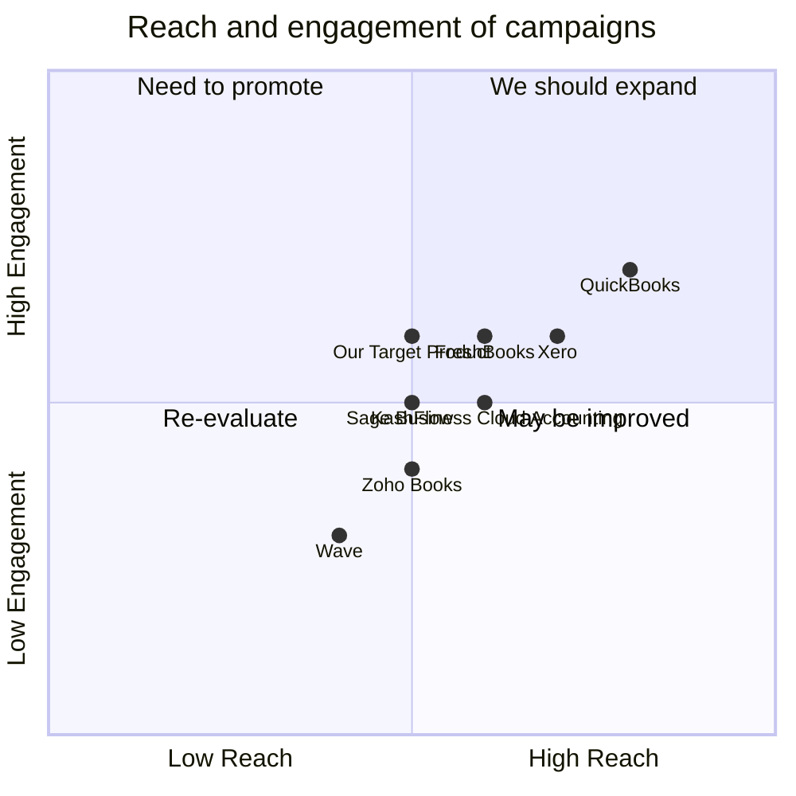

## Original Requirements
The boss has tasked us with building a website for tracking cashflows and workflows in a business. The website should be able to handle allocations, payments, contributors, and other related features.

## Product Goals
```python
[
    "Create a user-friendly website for tracking cashflows and workflows in a business",
    "Ensure the website can handle allocations, payments, contributors, etc",
    "Design the website to be efficient and reliable for daily business operations"
]
```

## User Stories
```python
[
    "As a business owner, I want to track my business's cashflows and workflows so that I can manage my finances effectively",
    "As a financial manager, I need to allocate funds to different departments and track these allocations",
    "As an employee, I want to see my contributions to the company's cashflows and workflows",
    "As a stakeholder, I want to monitor the company's financial activities for transparency and accountability",
    "As an accountant, I need to make payments and track these transactions for record-keeping"
]
```

## Competitive Analysis
```python
[
    "QuickBooks: A comprehensive accounting software with a user-friendly interface, but may be too complex for small businesses",
    "FreshBooks: Offers excellent invoicing capabilities and time tracking, but lacks advanced reporting features",
    "Zoho Books: Provides a wide range of features, but the user interface can be confusing for some users",
    "Wave: Free to use and offers a good range of features, but customer support is lacking",
    "Xero: Offers a robust set of features and integration capabilities, but can be expensive for small businesses",
    "Sage Business Cloud Accounting: Offers a wide range of features, but the user interface is not as intuitive as other competitors",
    "KashFlow: Offers a good range of features and is easy to use, but lacks advanced reporting capabilities"
]
```

## Competitive Quadrant Chart


## Requirement Analysis
The product should be a user-friendly and efficient website for tracking cashflows and workflows in a business. The website should be able to handle allocations, payments, contributors, and other related features. It should be reliable for daily business operations and offer transparency and accountability for stakeholders.

## Requirement Pool
```python
[
    ("Implement a feature for tracking cashflows and workflows", "P0"),
    ("Implement a feature for handling allocations", "P0"),
    ("Implement a feature for handling payments", "P0"),
    ("Implement a feature for tracking contributors", "P1"),
    ("Ensure the website is efficient and reliable for daily business operations", "P0")
]
```

## UI Design draft
The website should have a clean and intuitive interface. The main dashboard should display an overview of the cashflows and workflows, with options to view more detailed information. There should be separate sections for allocations, payments, and contributors, each with their own set of features. The layout should be organized and easy to navigate, with clear labels and instructions.

## Anything UNCLEAR
There are no unclear points.