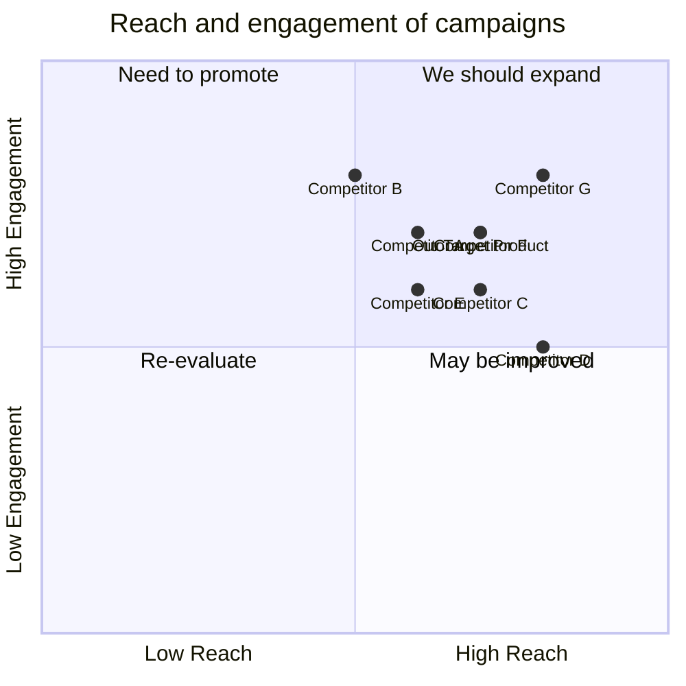

## Original Requirements:
Create a website for a software solutions engineering agency to present a portfolio of work and enable incoming consultation requests with a form that collects details about new projects from potentially interested customers. Consider services provided, projects, service packages with cost estimates, and anything else you can think of.

## Product Goals:
- Create a professional and visually appealing website that showcases the agency's portfolio of work.
- Provide a user-friendly interface for potential customers to submit consultation requests.
- Include comprehensive information about the agency's services, projects, and service packages with cost estimates.

## User Stories:
- As a user, I want to easily navigate through the website and view the agency's portfolio of work.
- As a user, I want to be able to submit a consultation request easily and provide all the necessary details about my project.
- As a user, I want to be able to view detailed information about the agency's services, projects, and service packages.
- As a user, I want to be able to contact the agency directly for any inquiries or additional information.
- As a user, I want the website to be responsive and accessible on different devices and screen sizes.

## Competitive Analysis:
- Competitor A: Offers a similar range of services and has a visually appealing website.
- Competitor B: Provides detailed information about their projects and has a user-friendly consultation request form.
- Competitor C: Offers service packages with cost estimates and has a responsive website design.
- Competitor D: Has a comprehensive portfolio of work and provides clear contact information on their website.
- Competitor E: Offers a variety of services and has a modern and visually appealing website.
- Competitor F: Provides detailed information about their service packages and has a user-friendly navigation menu.
- Competitor G: Offers a seamless user experience and has a visually appealing website design.

## Competitive Quadrant Chart:


## Requirement Analysis:
The product should be a website that showcases the agency's portfolio of work and allows potential customers to submit consultation requests. It should provide comprehensive information about the agency's services, projects, and service packages with cost estimates. The website should have a user-friendly interface, be visually appealing, and responsive on different devices.

## Requirement Pool:
```python
[
    ("Create a visually appealing website design", "P0"),
    ("Implement a user-friendly navigation menu", "P0"),
    ("Include a portfolio section to showcase the agency's work", "P0"),
    ("Design a consultation request form to collect project details", "P0"),
    ("Provide detailed information about the agency's services", "P1")
]
```

## UI Design draft:
The website will have a clean and modern design with a simple color scheme. The homepage will feature a navigation menu at the top, followed by a hero section with a brief introduction to the agency. Below the hero section, there will be sections to showcase the agency's services, projects, and service packages. Each section will have a thumbnail image and a short description. The consultation request form will be easily accessible from the navigation menu and will collect details such as the customer's name, email, project description, and budget. The website will be responsive and adapt to different screen sizes.

## Anything UNCLEAR:
There are no unclear points.