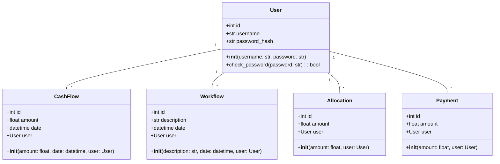
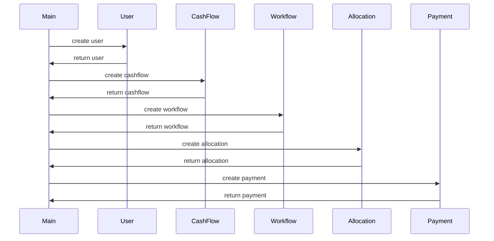

## Implementation approach
We will use Flask, a lightweight and flexible Python web framework, for the backend of the website. Flask-SQLAlchemy will be used for database operations, and Flask-WTForms for form handling. For the frontend, we will use Bootstrap to create a responsive and user-friendly interface. We will also use Chart.js for displaying cashflow and workflow data in a visually appealing way.

## Python package name
```python
"business_flow_tracker"
```

## File list
```python
[
    "main.py",
    "models.py",
    "forms.py",
    "routes.py",
    "templates/index.html",
    "templates/layout.html",
    "templates/login.html",
    "templates/register.html",
    "templates/dashboard.html",
    "static/css/main.css",
    "static/js/main.js"
]
```

## Data structures and interface definitions


## Program call flow


## Anything UNCLEAR
The requirement is clear to me.