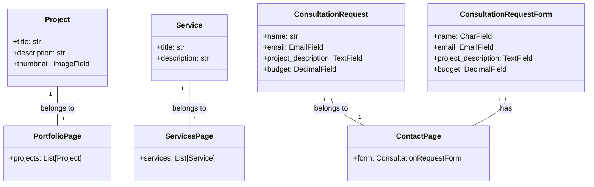
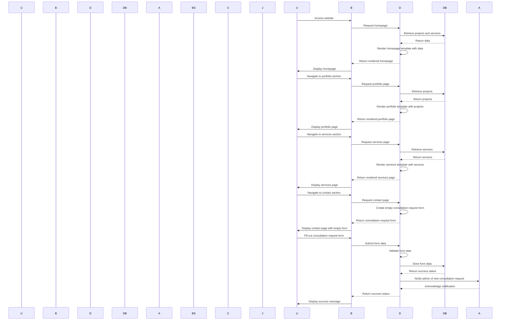

## Implementation approach:
For the implementation of the website, we will use the Django framework, which is a high-level Python web framework that follows the model-view-controller (MVC) architectural pattern. Django provides a robust set of tools and features for building web applications, including a built-in admin interface, ORM for database management, and support for handling forms and user authentication.

To create a visually appealing website design, we will use the Bootstrap framework, which is a popular open-source CSS framework that provides a responsive grid system and pre-designed components. Bootstrap will help us create a modern and visually appealing user interface that adapts to different screen sizes.

For the portfolio section, we will use the Django admin interface to manage and showcase the agency's work. We will create a model for projects and services, and use the admin interface to add, edit, and delete entries. The portfolio section will display thumbnail images and short descriptions of each project or service.

To implement the consultation request form, we will use Django's built-in form handling capabilities. We will create a form model that collects details such as the customer's name, email, project description, and budget. When a user submits the form, we will validate the input and store the data in the database.

For providing detailed information about the agency's services, we will create a separate page that displays the services offered by the agency. We will use Django's template system to render the information dynamically from the database.

## Python package name:
```python
"software_solutions_website"
```

## File list:
```python
[
    "main.py",
    "models.py",
    "forms.py",
    "views.py",
    "urls.py",
    "templates/index.html",
    "templates/services.html",
    "templates/portfolio.html",
    "templates/contact.html",
    "static/css/style.css",
    "static/js/script.js"
]
```

## Data structures and interface definitions:


## Program call flow:


## Anything UNCLEAR:
The requirements are clear to me.